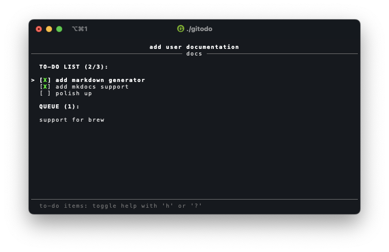

# Welcome to gitodo docs

To see what is gitodo and what can it do, [check here](gitodo.md). You can also read about the motivation behind it's development in my blog post: [Committing upfront](https://www.drazengolic.com/blog/committing-upfront/).

## Installation

Currently it's only possible to install the application via source.

### Prerequisites:

1. [Go](https://go.dev/dl/) 1.23.4 or newer
2. GCC
    1. MacOS: XCode, or type `xcode-select --install` in Terminal if you don't want the full app
    2. Linux: install `build-essential` package or equivalent
    3. Windows: install MSYS2 package in your PATH, or if you're using Scoop: `scoop install gcc`
    
After the prerequisites are installed, execute the following command:

`go install github.com/drazengolic/gitodo@latest`

The application is tested on macOS and Ubuntu Linux. It works on Windows as well, but it's kind of sluggish, and you must use the Windows Terminal.